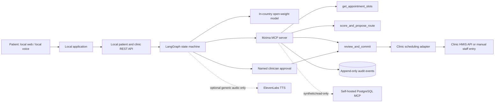

# Mzima Architecture

**Prototype target:** one simulated outpatient facility; synthetic data only. Full appointment requests run on an open-weight model hosted in-country. This repository currently contains design documents, not a runnable implementation.

## Agent and trust boundaries

LangGraph carries a typed task state through intake, slot lookup, guidance lookup, proposal, clinician review, commit verification and response. The agent may plan and invoke tools, but cannot approve itself. The Mzima MCP server's `score_and_propose_route` creates a pending proposal; `review_and_commit` requires an authenticated clinician, explicit decision, reason, proposal ID and one-time approval token. Writes are idempotent and auditable. Uncertainty or repeated failure routes to a staff handoff.

The model supplies structured extraction and a rationale grounded in retrieved fields. Deterministic facility-approved constraints validate allowable sectors, priorities and missing information. No generated diagnosis becomes a routing fact. The patient sees only confirmed booking information.

## Clinic API boundary

The patient and staff clients call Mzima's authenticated local REST API; they do not connect to MCP directly. Prototype routes: `POST /api/appointment-requests`, `GET /api/clinic/review-queue`, `POST /api/appointment-requests/{id}/decision`, and `GET /api/appointments/{id}`. Once a clinician approves, an internal idempotent adapter sends the booking to the clinic's documented scheduling/HMIS API. If the facility has no usable API, staff see the approved booking in Mzima and enter it manually. Until a pilot site is selected, demonstrate this with a mock local clinic API; do not claim FHIR/HMIS integration exists.

## MCP servers: built and borrowed

| Server | Ownership / access | Why |
|---|---|---|
| Mzima MCP | Built for the project; local and narrow | Domain-specific slot lookup, pending route scoring/proposal, and gated clinician commit are the core reusable agent tools. |
| PostgreSQL MCP | Existing maintained server; self-hosted and read-only, synthetic/de-identified database only | Reusing a reviewed general database connector is faster than implementing generic SQL protocol handling; read-only scope avoids turning it into an unreviewed write path. |

Do not expose the production patient database to either a general-purpose agent client or a third-party MCP service. A FHIR MCP can be evaluated later against an in-country sandbox; it is not required for this prototype.

## Model and voice

Host one open-weight model and inference runtime inside the country. Verify that prompts, outputs, logs, telemetry, backups and support access also remain in-country. A frontier model can be compared only on synthetic records. Keep patient speech recognition and personalized speech generation local. ElevenLabs may produce generic non-personal phrases only, unless an in-country deployment and contractual data path are verified.

## Logs and approval

For each tool call record the timestamp, correlation ID, actor, tool name, minimized inputs, output, status and retry count. For every queue-affecting commit record the before/after values, decision reason, named clinician identifier and approval timestamp. Protect audit records from ordinary editing and define access/retention with the facility.

## Recovery

Bound retries to idempotent reads and transient failures. Never repeat a commit without the same idempotency key. Validate all tool responses. If slots are stale, the model is uncertain, approval expires, or recovery limits are reached, do not commit; show a clear staff handoff. The demo should show at least one such recovery path.
