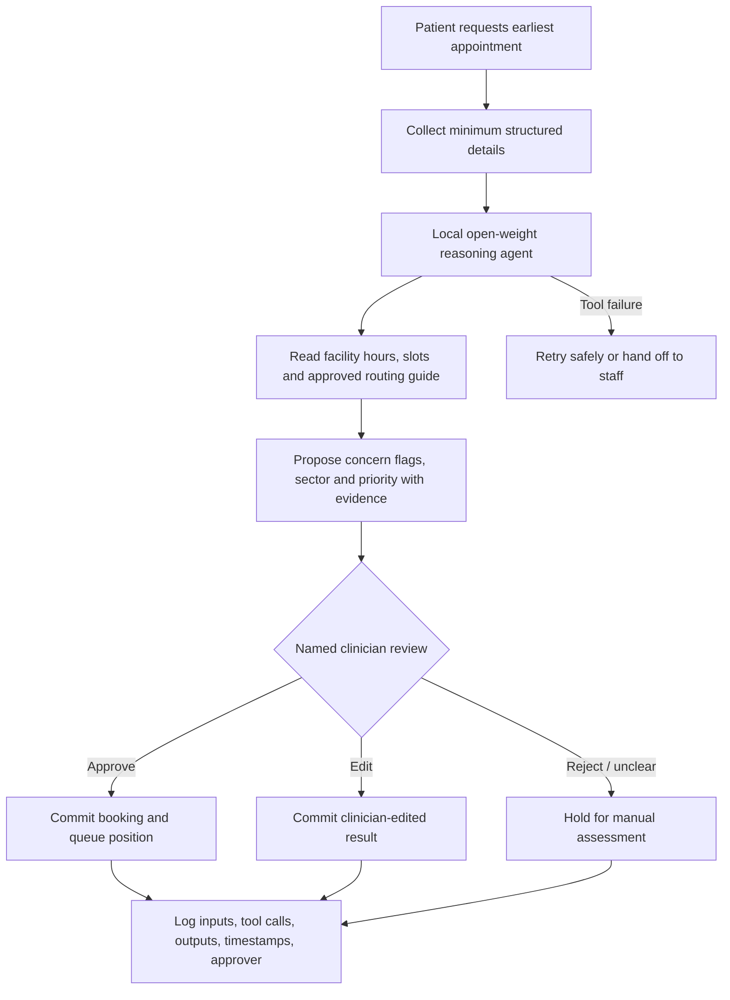
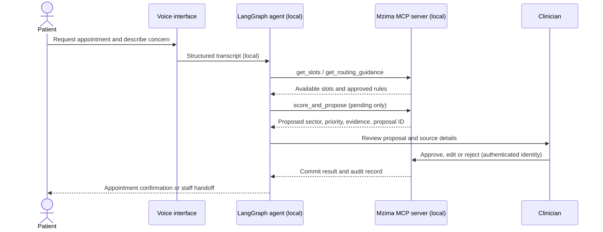
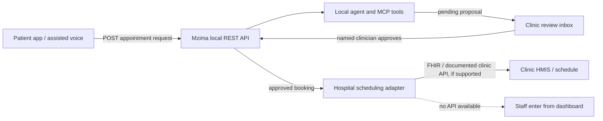

# Mzima | Appointment and Routing Co-pilot

**Concept draft · Kenya · Prototype scope: one outpatient facility and one booking workflow**

> Mzima is not a diagnostic system. It gathers patient-reported reasons for a visit, identifies possible safety concerns for clinician review, and proposes an appointment sector. A named clinician must approve any priority, referral, deterioration flag, or change to queue position. No agent action silently changes care.

## The idea

Patients request the earliest available appointment, using a web or assisted voice flow. A locally hosted reasoning agent gathers structured details, checks availability and facility-approved routing guidance, then proposes a sector and urgency for review. A clinician accepts, edits, or rejects the proposal. Only the approved result is written to the patient queue. The agent can ask follow-up questions, recover from tool errors, and explain its proposal with evidence.

Initial sectors are configured by the pilot facility; do not assume a universal list or clinical protocol. The prototype uses synthetic patient records and a simulated facility. It is not for live care until clinical, privacy, ethics, and operational approvals are in place.

## Flow

## How the clinic receives requests

The clinic needs a staff-facing inbox and an integration boundary. The patient app submits to Mzima's local API; the agent creates a **pending** request; clinic staff review it in the Mzima dashboard. After approval, Mzima confirms the booking locally and sends it to the clinic's scheduling/HMIS API through a facility-specific adapter, if one is available. If no supported API exists, the approved booking appears in the staff dashboard for manual entry. MCP tools are used by the agent internally; they are not the hospital's patient-facing API.

Prototype API shape (all routes served locally; authentication and role checks required):

| Route | Caller | Purpose |
|---|---|---|
| `POST /api/appointment-requests` | Patient app or clerk | Create a request; return request ID and review status, not a confirmed appointment |
| `GET /api/clinic/review-queue` | Authenticated clinic staff | Show pending requests and agent evidence |
| `POST /api/appointment-requests/{id}/decision` | Named clinician | Approve, edit, or reject; approval records clinician identity and reason |
| `GET /api/appointments/{id}` | Patient app or staff | Read confirmed slot and status |
| `POST /api/integrations/clinic/bookings` | Internal adapter only | Deliver an approved booking to a documented clinic/HMIS endpoint; idempotent, audited, and retried safely |

The exact hospital endpoint cannot be selected until the pilot clinic and its HMIS are known. Do not assume FHIR support. The prototype can demonstrate the adapter against a local mock clinic API using synthetic bookings.

## Agent craft

Use an open-source orchestrator such as **LangGraph** with explicit state and bounded steps:

1. Parse the request into a validated schema; ask a focused follow-up if required fields are missing.
2. Retrieve only facility-approved routing guidance and current appointment slots.
3. Produce a structured proposal with cited input fields, uncertainty, and a no-match/urgent-review option.
4. Call the custom MCP scoring/proposal tool. It writes a **pending proposal**, never a live queue change.
5. Pause for an authenticated named clinician. On rejection or edit, preserve the clinician's result and reason.
6. Verify the committed state. Retry transient read failures with a limit; make writes idempotent; on unresolved errors, stop and hand off.

This is a tool-using workflow, not a prompt wrapped around a model call. Tool outputs are schema-validated. The model cannot approve itself, alter routing rules, or call the commit action without a clinician approval token. No free-text chain of thought is stored; log concise evidence and decisions instead.

## MCP tools

### Mzima-owned MCP server (three tools)

| Tool | Effect | Guardrail |
|---|---|---|
| `get_appointment_slots` | Reads facility-configured services, slots and capacity | No patient data required |
| `score_and_propose_route` | Applies approved rule checks and stores a pending sector/priority/flag proposal | Every output is a proposal; include evidence and rule version |
| `review_and_commit` | Approves, edits, rejects, or commits referral/flag/queue position | Requires authenticated named clinician, reason, proposal ID and one-time approval token; logs before/after values |

Every MCP invocation records actor/agent, tool name, minimal inputs, output, timestamp, correlation ID and outcome. Every irreversible commit records the approving clinician's identity and timestamp. A model-generated identity is never accepted.

### Borrowed MCP server

Use a **self-hosted, read-only PostgreSQL MCP server** against synthetic demo data (or an in-country, de-identified reporting replica after approval). It is a maintained general-purpose connector; reusing its database protocol and read-only query support is safer and faster than writing a second database MCP server. Pin and review the implementation, disable writes, restrict network access, and expose no production patient database to a general agent.

## Models, privacy and voice

- Run the full appointment task on an **open-weight model served inside the country** (for example, a locally hosted model through Ollama or vLLM). Do not send patient health data, audio, transcripts, prompts, logs, or identifiers outside the country. Confirm where inference, storage, telemetry and backups occur.
- A frontier API may appear only as a side-by-side comparison on synthetic data, clearly labelled and isolated from the patient-data path.
- **ElevenLabs:** optional TTS for generic, non-personal prompts only (e.g. “Please wait for staff”). Never send patient speech, symptoms, names, appointment details or generated personalized responses to a hosted ElevenLabs service unless an approved in-country deployment is verified. Prefer local speech recognition for patient input and local TTS for personalized replies. Test Kenyan English/Kiswahili with local speakers; voice is an interface, not a triage authority.
- Keep only the minimum structured booking data. Define consent, access, encryption, retention, audit review and deletion with the facility before handling real records.

Detailed data fields, safeguards, retention, patient rights and pilot governance are in [DATA_AND_PRIVACY.md](DATA_AND_PRIVACY.md).

## Five-day prototype boundary

Build a new, demonstrable vertical slice: patient request → local agent → three working MCP tools → clinician approval gate → committed synthetic booking → audit log. Use one facility, a small configured sector list, seeded appointment slots, and synthetic cases. No EMR integration, production SMS, diagnosis generation, autonomous referral, or live patient queue changes in the prototype.

## Submission checklist

- Public repository with OSI-approved licence and a one-command local start.
- Under-three-minute public demo: unedited agent run, tool calls visible, including a recovery or handoff.
- Around-300-word project description naming the sub-theme, facility and workflow.
- `ARCHITECTURE.md`: one-page agent shape, built vs borrowed MCP, and rationale.
- `EVALS.md`: at least eight tasks with actual pass/fail results, plus an unfixed failure and next experiment. Do not label planned checks as results.

## Open decisions

Pilot facility and service sectors; facility routing protocol; local hosting/operator; selected open-weight model and hardware; intended “Evax” product (name is ambiguous); locally acceptable voice workflow; privacy/ethics approvals.
